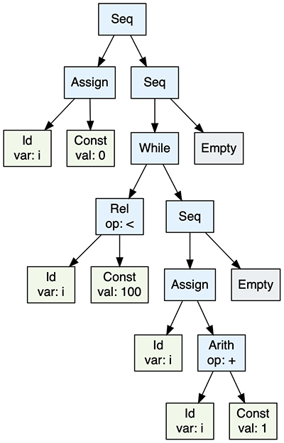

## The Dragon Book Compiler in C++

A compiler consists of a syntax-directed translator for C-like language into the intermediate three-address code (TAC) using the recursive descent parsing approach described in the Dragon Book, following the guidelines of the book but in modern C++17 instead of Java. 

The program allows the export of the Abstract Syntax Tree (AST) of the parsed program into JSON format or into the Dot format in order to generate diagrams of the AST using GraphViz.

### Build

```bash
$ mkdir build
$ cd build
$ cmake ..
$ make
```

### Usage

```bash
Usage: <app_name> input_file [options]
   -j, --json filepath     output ast to json in filepath
   -d, --dot filepath      output ast to dot in filepath
```

### Example

An example output of the following program:

```bash
$ cat example2.txt
{
	int i;
	i = 0;
	while (i < 100) { 
		i = i + 1;
	}
}
```

```bash
compiler example2.txt -j ast.json -d ast.dot
```

Three-address code:

```
L1:     i = 0
L3:     iffalse i < 100 goto L2
L4:     i = i + 1
        goto L3
L2:
```

AST diagram rendered in the GraphViz:


